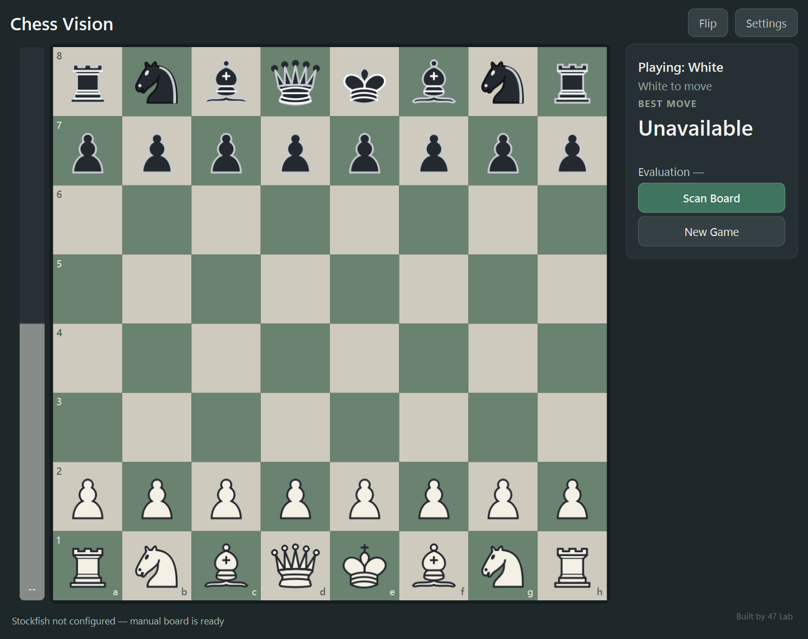
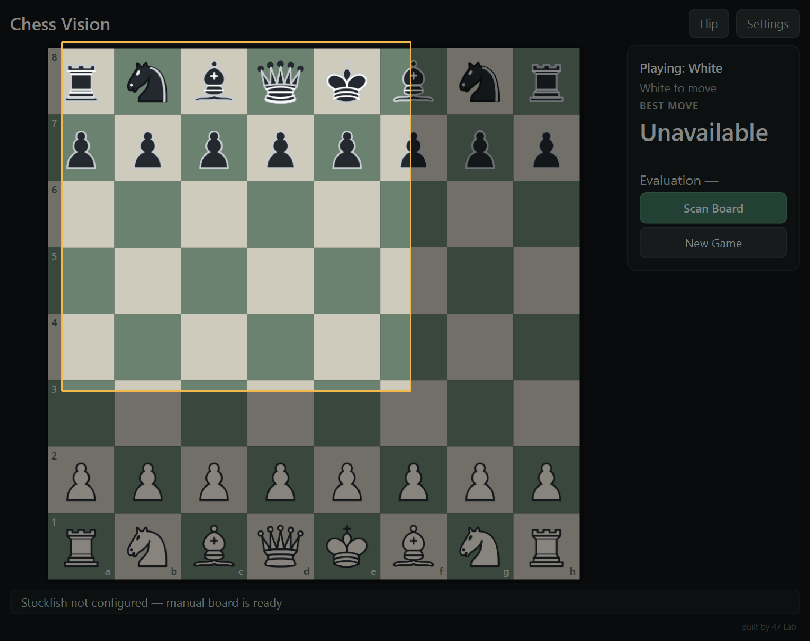
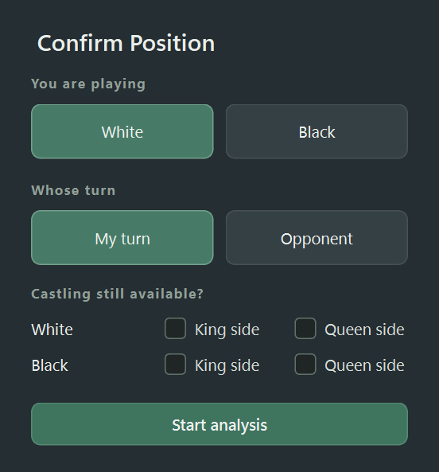
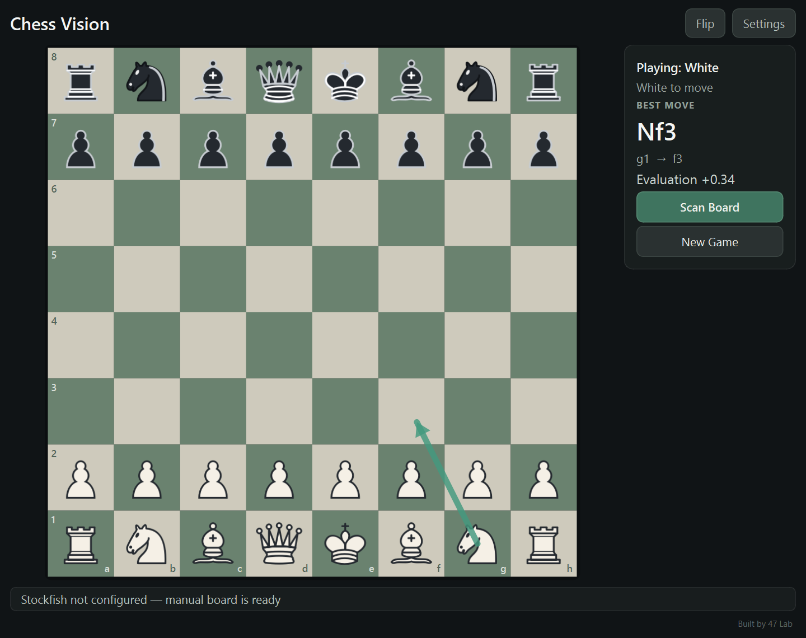

# Chess Vision Assistant

Chess Vision is a focused Windows desktop chess-analysis companion. Capture a position once with AI, confirm the chess metadata, then explore legal moves manually while Stockfish evaluates locally.



> Chess Vision 2.5 adds Analysis, local Player vs Player, and Stockfish Player vs Computer modes, with one-time AI scanning in Analysis mode.

## Overview

The `python-chess` board is the source of truth. OpenAI vision reconstructs a selected board image only during Scan Board or Rescan. Users enter both sides' later moves, local chess rules validate them, and separately installed Stockfish provides analysis.

## Features

- DPI-aware one-time capture and OpenAI reconstruction
- Player, turn, and midgame castling confirmation
- Legal click/drag moves, promotion, castling, en passant, undo/redo
- Local asynchronous Stockfish best move, evaluation, and arrow
- Left/Right arrow-key undo/redo with exact chess-state restoration
- Animated White-perspective evaluation bar beside the board
- Terra/Luna recognition selection and a persistent Stockfish Suggestions toggle
- Responsive wide and split-screen layouts with board flipping
- Windows Credential Manager storage for each user's API key
- No bundled API key, Stockfish binary, ML runtime, or browser tracking

## Screenshots

| Capture | Confirmation | Analysis |
|---|---|---|
|  |  |  |

See the [user guide](docs/USER_GUIDE.md) for Settings and split-screen examples.

## How It Works

1. Select **Scan Board** and capture all 64 squares.
2. The selected image is sent to the configured OpenAI API.
3. Confirm player color, turn, and valid castling rights.
4. Enter moves manually for both sides; `python-chess` enforces rules.
5. Stockfish evaluates the canonical position locally. Use **Rescan** for a new import.

See [Architecture](docs/ARCHITECTURE.md) for the real component flow.

## Download for Windows

Go to [Releases](https://github.com/Hamras47/Chess-Vision-Assistant/releases) and download `ChessVision-Windows-x64.zip`.

Extract the ZIP, open the `ChessVision` folder, and run `ChessVision.exe`. No Python installation or command prompt is required. In **Settings**, add your own OpenAI API key for board scanning and select your separately installed Stockfish executable for analysis.

### Windows App

When a Windows binary release is available, download and extract the **complete distribution ZIP**, then double-click `ChessVision.exe` inside the extracted `ChessVision` folder. Keep `_internal`, licenses, and the executable together; copying only the EXE will not work. You can also build this folder from source using the instructions below. It opens without a command prompt. Manual board use does not require OpenAI or Stockfish.

### OpenAI Setup

Open **Settings**, enter your own key, select **Test Connection**, then **Save**. Saved credentials use Windows Credential Manager through `keyring`. Precedence is secure credential store, `OPENAI_API_KEY`, then no key. No developer key is included. Without a key, Scan Board directs you to Settings rather than crashing.

### Stockfish Setup

Stockfish is an independent open-source UCI engine. Download Windows Stockfish from the [official download page](https://stockfishchess.org/download/), extract it, then choose `stockfish.exe` with **Settings → Browse → Test Engine**. Analysis remains local. Stockfish is GPLv3 and is not bundled.

## User Guide

The [full user guide](docs/USER_GUIDE.md) covers installation, first launch, scanning, confirmation, manual moves, playing Black, castling, en passant, promotion, flip, rescanning, settings, and troubleshooting.

## Midgame Scanning

A still image cannot prove move history. Midgame imports therefore start without en-passant state and without castling rights unless explicitly confirmed.

## Castling

The confirmation dialog offers rights only when the king and matching rook occupy starting squares. Exact starting layouts receive normal rights automatically.

## En Passant

Imported images have no inferred en-passant target. During subsequent manual play, `python-chess` handles en passant normally.

## Promotion

Moving a pawn to the final rank opens a queen, rook, bishop, or knight chooser.

## Board Orientation / Flip

Confirmed player color sets initial orientation. **Flip** or `F` rotates display only.

## Rescanning

**Rescan** performs another one-time visual import and replaces current position/history after confirmation.

## Settings

Settings groups AI recognition, the chess engine, and application information. Select **GPT-5.6 Terra** (default) or **GPT-5.6 Luna**. Terra balances intelligence and cost; Luna is the lighter, lower-cost option. The saved model takes precedence over `OPENAI_VISION_MODEL`, then the Terra default. Unsupported saved values fall back to the environment/default. Exact API IDs: `gpt-5.6-terra`, `gpt-5.6-luna` ([official model catalog](https://developers.openai.com/api/docs/models)). Account access still depends on your API project.

**Stockfish Suggestions** defaults to On. Off stops automatic analysis and hides arrows, with a neutral dimmed evaluation bar. Manual moves and scanning remain available. API keys stay in the OS credential store; they are never written to QSettings or packaged files.

## Keyboard navigation and evaluation

**Left Arrow** undoes one move; **Right Arrow** redoes it. Navigation restores turn, castling and en-passant state. Making a new move after undo clears the redo branch. Text fields, dropdowns and modal dialogs retain their normal arrow-key behavior.

The vertical bar grows White's region for positive evaluation and Black's for negative evaluation. Flipping the board moves the regions to match the displayed sides without changing the score. `M3` means White has mate in three; `-M2` means Black has mate in two. Finite scores use a bounded curve, not a win-probability estimate.

## Building From Source

Use 64-bit Windows and Python 3.11–3.14 (release build tested with Python 3.14):

```powershell
git clone <repository-url>
cd chess-vision
python -m venv .venv
.\.venv\Scripts\Activate.ps1
python -m pip install --upgrade pip
python -m pip install -e ".[dev]"
python -m app.main
```

Verify and build:

```powershell
python -m compileall app
pytest -v
powershell -ExecutionPolicy Bypass -File .\scripts\build_windows.ps1
```

The maintained [PyInstaller specification](ChessVision.spec) creates `dist/ChessVision/ChessVision.exe`, includes UI assets, and excludes unused ML stacks. The adjacent `_internal` directory is part of the application and must be distributed with the executable.

## Privacy & Security

Only the board image explicitly selected during Scan Board/Rescan is sent to OpenAI. Manual moves are not continuously streamed. Stockfish runs locally. Users own their credentials; Chess Vision ships without a shared 47 Lab key.

## Troubleshooting

- **API key required:** save and test a key in Settings.
- **Network unavailable/timeout:** check connectivity and retry.
- **Stockfish not configured:** browse to and test `stockfish.exe`.
- **Recognition fails:** tightly select all squares without overlays.
- **No castling:** confirm the pieces and castling right during import.

## Development Journey

[CHANGELOG.md](CHANGELOG.md) records the progression from capture prototypes through ML and hybrid-tracking research to the stable architecture.

## Roadmap

Possible research includes live tracking, stronger real-world multi-theme recognition, hybrid verification, and confidence-aware recovery. These are not current features.

## Contributing

Open an issue before large architectural changes. Preserve deterministic canonical state, add tests, run `pytest -v`, and never commit credentials or private captures.

## License

Chess Vision Assistant is licensed under [GNU GPL version 3 or later](LICENSE). Third-party software and artwork retain their own licenses; see [licensing details](docs/LICENSING.md) and [notices](THIRD_PARTY_NOTICES.md).

## Credits

- [Stockfish](https://stockfishchess.org/) community — engine, GPLv3 (not bundled)
- [python-chess](https://python-chess.readthedocs.io/) — rules/UCI, GPL-3.0-or-later
- Qt for Python / PySide6 — UI, LGPLv3/GPLv3/commercial
- Cburnett pieces — CC BY-SA 3.0, adapted palette; see `assets/pieces/README.md`

## Built by 47 Lab

Chess Vision is built by 47 Lab with restrained in-app attribution.
