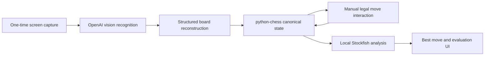

# Architecture

Chess Vision 2.47 separates probabilistic visual import from deterministic chess state. The existing V16 settings namespace is retained to preserve installed users' preferences.

## Authority and data flow

`ManualGameState` and its `python-chess.Board` are authoritative after a position is accepted. OpenAI is used only for Scan Board and Rescan. It reconstructs piece placement; the confirmation dialog supplies player color, side to move, and valid castling rights. Subsequent moves are entered by the user and checked locally by `python-chess`. Stockfish receives FEN positions through a long-lived background worker and returns MultiPV analysis.

The capture layer takes a frozen desktop snapshot and converts logical Qt coordinates to physical monitor coordinates for DPI-safe cropping. `OpenAIClient` sends only the selected board image. The responsive Qt view renders from canonical state and never changes chess rules.

Each manual history change invalidates older recognition tokens. Engine requests also carry monotonically increasing tokens so late results cannot update the current position. Engine shutdown retains Qt workers until they finish while leaving the event loop responsive.

The evaluation bar consumes Stockfish scores from White's perspective, using `0.5 + 0.49 * tanh(centipawns / 400)` for its White fraction. Forced mates use the endpoints. Flipping only changes which end displays White. Suggestions Off stops engine requests, clears arrows and dims the bar.

## Configuration and security

The OpenAI key is resolved from the OS credential store first, then `OPENAI_API_KEY`. On Windows, the `keyring` backend uses Windows Credential Manager. QSettings stores only non-secret preferences: model, analysis duration, suggestions enabled, debug mode, and Stockfish path. Stockfish is an external UCI executable and is not included in the application build.

Packaged resources are located through `app.core.resources`, which supports source checkouts and PyInstaller's frozen resource directory.
