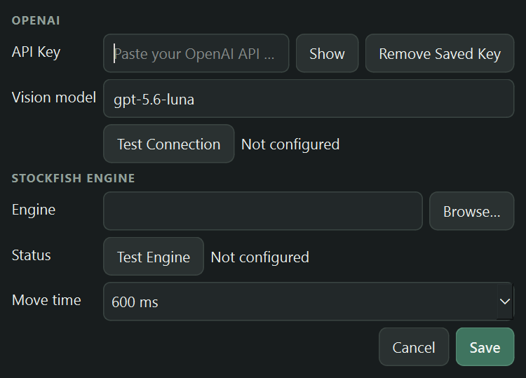
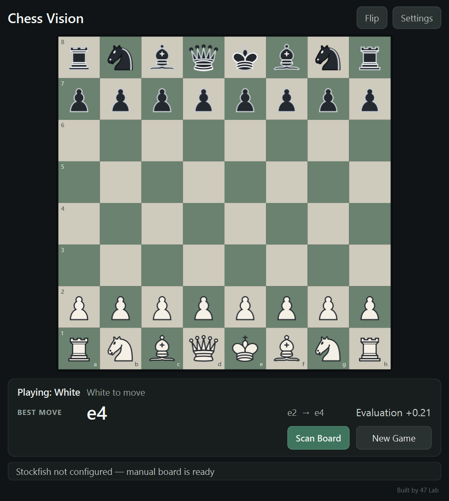

# Chess Vision User Guide

## Installation and first launch

When available on the project's release page, download the **complete Windows distribution ZIP** and extract it. Open the extracted `ChessVision` folder and double-click `ChessVision.exe`. Keep its `_internal` folder and license files beside it; the EXE alone is not a standalone application. If no binary release is listed, follow the README's build instructions. Chess Vision opens with a normal starting position; manual play works without an OpenAI key or Stockfish.

## Add your OpenAI API key

Open **Settings**, paste your own OpenAI API key, and select **Save**. The key is stored by the operating system's credential service—not in a project file or QSettings. **Show** reveals only text entered in the current session; an existing key remains represented by a masked placeholder. Select **Test Connection** for a non-blocking credential check.

If scanning says that a key is required, choose **Open Settings**. Invalid credentials, timeouts, and network failures are shown without echoing the key.

## Install Stockfish

Stockfish is the independent, open-source engine used for local analysis. Download it from [the official Stockfish website](https://stockfishchess.org/download/), extract the archive, then open **Settings** in Chess Vision. Select **Browse**, choose `stockfish.exe`, and select **Test Engine**. A successful check displays “Engine detected.” Stockfish is licensed under GPLv3 and is developed by the Stockfish community; it is not a 47 Lab product and is not bundled with Chess Vision.

## Scan and confirm a position

1. Put a chessboard on screen and select **Scan Board**.
2. Drag a square selection around all 64 squares. Only this selected image is sent to the configured OpenAI API.
3. Confirm whether you play White or Black and whose turn it is.
4. For a midgame position, enable only castling rights that still exist in the game.

Exact starting positions automatically receive normal castling rights. For midgame scans, Chess Vision cannot infer move history from a still image. Castling is available only when both the king and corresponding rook are on their starting squares and you explicitly confirm that right. En-passant history also cannot be reconstructed from a still image, so imported positions start without an en-passant target.

## Manual analysis

After import, move pieces for both sides by clicking a source and destination or dragging. Illegal moves are rejected. The best-move arrow and evaluation come from local Stockfish. Promotions ask you to choose queen, rook, bishop, or knight. Castling and en passant work whenever the canonical position contains the required rights.

**Flip** changes orientation without changing the position. **New Game** creates a starting board. **Rescan** replaces the current position and clears its undo/redo history. Keyboard shortcuts include `F` to flip, `Ctrl+Z`/`Ctrl+Y` for undo/redo, `Ctrl+R` to rescan, and `Ctrl+N` for a new game.

## Troubleshooting and privacy

- **No best move:** configure and test Stockfish; manual moves still work without it.
- **Could not verify board:** select the board edges tightly, avoid overlays, and retry.
- **Wrong side or orientation:** use Rescan for metadata changes or Flip for display only.
- **Connection error:** verify internet access and test the key in Settings.

Scan Board sends the selected board screenshot to OpenAI for recognition. Normal manual moves are not continuously sent to OpenAI. Stockfish analysis runs locally. Chess Vision ships with no shared API key; credentials belong to each user and are stored with the OS credential service.
